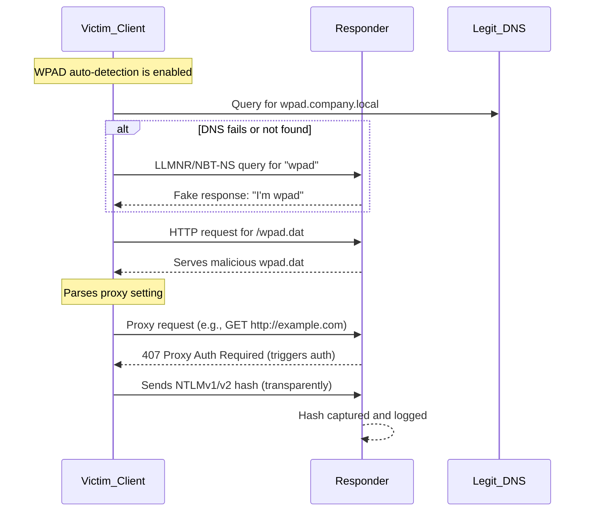

```mermaid
sequenceDiagram

    participant Victim_Client

    participant Responder

    participant Legit_DNS

  

    Note over Victim_Client: WPAD auto-detection is enabled

  

    Victim_Client->>Legit_DNS: Query for wpad.company.local

    alt DNS fails or not found

        Victim_Client->>Responder: LLMNR/NBT-NS query for "wpad"

        Responder-->>Victim_Client: Fake response: "I'm wpad"

    end

  

    Victim_Client->>Responder: HTTP request for /wpad.dat

    Responder-->>Victim_Client: Serves malicious wpad.dat

  

    Note over Victim_Client: Parses proxy setting

  

    Victim_Client->>Responder: Proxy request (e.g., GET http://example.com)

    Responder-->>Victim_Client: 407 Proxy Auth Required (triggers auth)

  

    Victim_Client->>Responder: Sends NTLMv1/v2 hash (transparently)

  

    Responder-->>Responder: Hash captured and logged

```