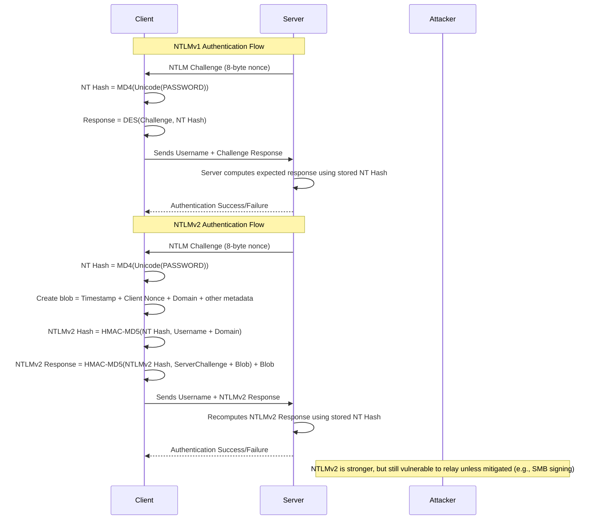

### 🔍 Key Differences

| Feature                  | NTLMv1                  | NTLMv2                            |
| ------------------------ | ----------------------- | --------------------------------- |
| Introduced               | Windows NT 4.0          | Windows NT 4.0 SP4                |
| Cryptographic Algorithm  | DES                     | HMAC-MD5                          |
| Replay Protection        | ❌ No                    | ✅ Yes (timestamp + client nonce)  |
| Session Security         | ❌ Limited               | ✅ Extended session security       |
| Hash Cracking Difficulty | Easy (fast brute force) | Harder (more complex blob)        |
| Recommended Today?       | ❌ Never                 | ⚠️ Only if Kerberos not available |

# NTLM Flow 
